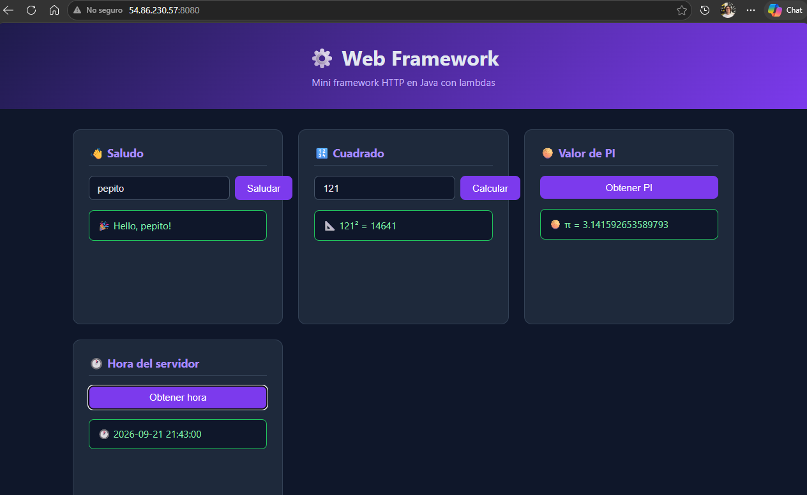
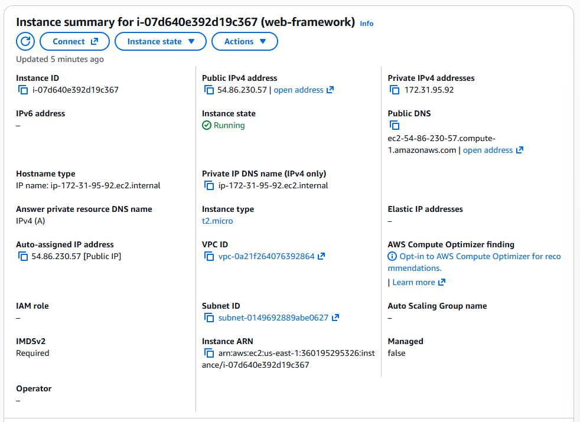
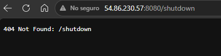

# ⚙️ Web Framework

Mini framework HTTP en Java que permite registrar endpoints mediante funciones lambda,
separando la infraestructura HTTP del comportamiento de la aplicación.

---

## 📖 Descripción

Este proyecto evoluciona un servidor HTTP básico en un mini framework web inspirado en
frameworks como Spark Java o Express.js. El desarrollador registra rutas usando lambdas
sin necesidad de modificar el loop principal del servidor.

```java
staticfiles("/webroot");

get("/hello", (req, resp) -> {
    String name = req.getValue("name");
    return "Hello, " + name + "!";
});

start();
```

---

## 🏛️ Metáfora del sistema

El framework funciona como un **edificio de oficinas**:

| Metáfora | Componente |
|----------|------------|
| Entrada y recepcionista | `HttpServer` — acepta conexiones TCP y parsea HTTP |
| Directorio del lobby | `Router` — mapea cada path a su handler lambda |
| Oficinas individuales | `RouteHandler` — lambdas que implementan cada servicio |
| Archivo de documentos | `StaticFileService` — sirve HTML, CSS, JS e imágenes |
| Formulario de solicitud | `Request` — encapsula método, path y query string |
| Respuesta oficial | `Response` — encapsula status y content-type |
| Configuración del edificio | Variables de entorno — PORT, APP_ENV, GREETING_PREFIX |
| Procedimiento de cierre | `stop()` — shutdown graceful después de atender la última petición |

El edificio atiende un visitante a la vez. La recepción lo dirige a la oficina correcta
o al archivo de documentos. Si no existe, recibe un aviso de recurso no encontrado.

---

## 🏗️ Arquitectura

```
Application.java
    │
    │  get("/hello", lambda)
    │  staticfiles("/webroot")
    │  start()
    ▼
WebFramework.java  ← API pública (fachada)
    │
    ├──► Router.java
    │        │
    │        │  resolve(path) → RouteHandler
    │        ▼
    │    RouteHandler (lambda)
    │        │
    │        ├── Request.java  ← método, path, query params
    │        └── Response.java ← status, content-type
    │
    └──► HttpServer.java
             │
             ├── Ruta dinámica encontrada → ejecuta lambda → responde JSON/texto
             ├── Archivo estático encontrado → StaticFileService → responde bytes
             └── Nada encontrado → 404 Not Found
```

---

## 📁 Estructura del proyecto

```
web-framework/
├── pom.xml
├── README.md
├── .gitignore
├── imgs/
│   ├── evd01-app-deployed-ec2.png
│   ├── evd02-aws-instance.png
│   └── evd03-shutdown-disabled.png
└── src/
    ├── main/
    │   ├── java/
    │   │   └── co/edu/escuelaing/
    │   │       ├── webframework/
    │   │       │   ├── WebFramework.java      ← API pública
    │   │       │   ├── HttpServer.java        ← Servidor TCP/HTTP
    │   │       │   ├── Router.java            ← Mapeo path → lambda
    │   │       │   ├── RouteHandler.java      ← Interfaz funcional
    │   │       │   ├── Request.java           ← Abstracción del request
    │   │       │   ├── Response.java          ← Abstracción del response
    │   │       │   └── StaticFileService.java ← Archivos estáticos
    │   │       └── app/
    │   │           └── Application.java       ← Aplicación de ejemplo
    │   └── resources/
    │       └── webroot/
    │           ├── index.html
    │           ├── styles.css
    │           ├── app.js
    │           └── images/
    │               └── logo.png
    └── test/
        └── java/
            └── co/edu/escuelaing/
                └── AppTest.java
```

---

## 🔑 Responsabilidades de cada componente

| Componente | Responsabilidad |
|------------|----------------|
| `WebFramework` | API pública: expone `get()`, `staticfiles()`, `start()`, `stop()` |
| `HttpServer` | Acepta conexiones TCP, parsea HTTP, delega al Router o StaticFileService |
| `Router` | Registra y resuelve rutas dinámicas mediante un mapa path → lambda |
| `RouteHandler` | Interfaz funcional que permite usar lambdas como handlers |
| `Request` | Encapsula método HTTP, path y query string con acceso por clave |
| `Response` | Encapsula status code y content-type de la respuesta |
| `StaticFileService` | Sirve archivos del classpath con detección de content-type |
| `Application` | Registra las rutas y configura el framework |

---

## ⚙️ Prerrequisitos

- Java 17+
- Maven 3.8+

---

## 🚀 Cómo ejecutar localmente

**1. Clonar el repositorio:**
```bash
git clone https://github.com/juanpablo012501/web-framework.git
cd web-framework
```

**2. Compilar:**
```bash
mvn clean package -DskipTests
```

**3. Ejecutar:**
```bash
java -jar target/web-framework.jar
```

**4. Abrir en el navegador:**
```
http://localhost:8080
```

---

## 🌍 Variables de entorno

| Variable | Propósito | Valor por defecto |
|----------|-----------|-------------------|
| `PORT` | Puerto del servidor HTTP | `8080` |
| `APP_ENV` | Entorno de ejecución | `development` |
| `GREETING_PREFIX` | Prefijo del mensaje de saludo | `Hello` |

> ⚠️ Cuando `APP_ENV=production` la ruta `/shutdown` no está disponible.

---

## 🔗 Endpoints disponibles

### Recursos estáticos

| URL | Descripción |
|-----|-------------|
| `GET /` | Página principal |
| `GET /index.html` | Página HTML |
| `GET /styles.css` | Estilos CSS |
| `GET /app.js` | JavaScript cliente |
| `GET /images/logo.png` | Imagen logo |

### Servicios dinámicos

| URL | Parámetros | Respuesta |
|-----|------------|-----------|
| `GET /hello?name=Juan` | `name` (opcional) | `Hello, Juan!` |
| `GET /pi` | ninguno | `3.141592653589793` |
| `GET /square?value=5` | `value` (requerido) | `{"input": 5.0, "square": 25.0}` |
| `GET /time` | ninguno | `{"serverTime": "2026-09-21 21:43:00"}` |
| `GET /shutdown` | ninguno | Solo disponible en `development` |

---

## 🧪 Pruebas realizadas

| Prueba | URL | Resultado |
|--------|-----|-----------|
| Página principal | `GET /` | ✅ 200 OK |
| Saludo con nombre | `GET /hello?name=Juan` | ✅ `Hello, Juan!` |
| Saludo sin nombre | `GET /hello` | ✅ `Hello, world!` |
| Valor de PI | `GET /pi` | ✅ `3.141592653589793` |
| Cuadrado válido | `GET /square?value=121` | ✅ `121² = 14641` |
| Hora del servidor | `GET /time` | ✅ JSON con hora |
| Archivo faltante | `GET /noexiste.html` | ✅ 404 Not Found |
| Shutdown en desarrollo | `GET /shutdown` | ✅ Servidor se detiene |
| Shutdown en producción | `GET /shutdown` | ✅ 404 Not Found |
| Path traversal | `GET /../etc/passwd` | ✅ 403 Forbidden |

---

## ☁️ Deploy en AWS EC2

**Plataforma:** Amazon Web Services — EC2  
**Sistema operativo:** Amazon Linux 2023  
**Tipo de instancia:** t2.micro  
**URL pública:** `http://54.86.230.57:8080`

### Pasos para reproducir el deploy:

**1. Lanzar instancia EC2** con Amazon Linux 2023, t2.micro

**2. Configurar Security Group** — abrir puerto 8080 (Custom TCP, 0.0.0.0/0)

**3. Conectarse por SSH:**
```bash
ssh -i "web-framework-key.pem" ec2-user@54.86.230.57
```

**4. Instalar Java 17:**
```bash
sudo yum install -y java-17-amazon-corretto
```

**5. Subir el JAR:**
```bash
scp -i "web-framework-key.pem" target/web-framework.jar ec2-user@54.86.230.57:~/
```

**6. Ejecutar en producción:**
```bash
APP_ENV=production nohup java -jar web-framework.jar > server.log 2>&1 &
```

---

## 📸 Evidencias

### Aplicación desplegada y accesible públicamente


### Instancia EC2 en consola AWS


### Shutdown deshabilitado en producción (404)


---

## 🔧 ¿Por qué esta arquitectura es mantenible?

| Principio | Aplicación en este laboratorio |
|-----------|-------------------------------|
| Separación de responsabilidades | La infraestructura HTTP está separada del comportamiento de la aplicación |
| Bajo acoplamiento | Agregar una ruta no requiere modificar el loop del servidor |
| Alta cohesión | Cada clase tiene una única responsabilidad clara |
| Abstracción | El desarrollador usa `get()` y `staticfiles()` sin manejar sockets |
| Configuración externalizada | Puerto, entorno y prefijo vienen de variables de entorno |
| Extensibilidad | Nuevos servicios se agregan registrando lambdas |
| Testabilidad | Router, Request y handlers pueden probarse independientemente |

---

## ⚠️ Limitaciones conocidas

- El servidor es **secuencial**: procesa una conexión a la vez.
- No soporta HTTPS.
- Solo maneja el método GET.
- No es un servidor de producción.

---

## 👤 Autor

**Juan Pablo Velez Munoz**  
Escuela Colombiana de Ingeniería Julio Garavito  
Laboratorio AREP
