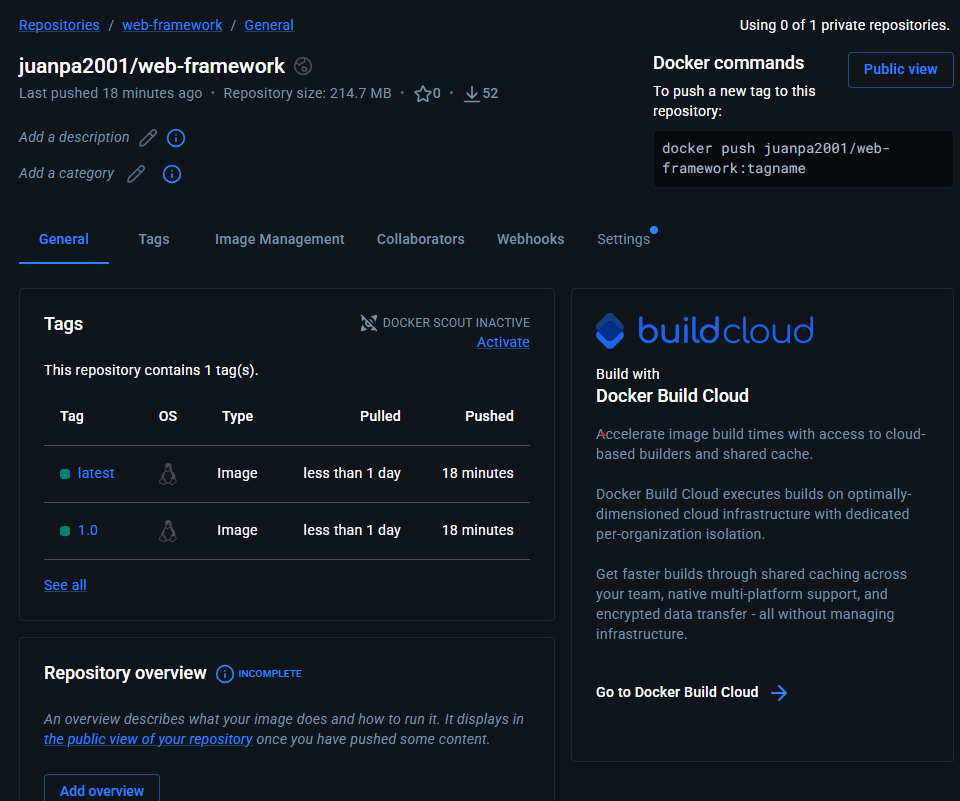
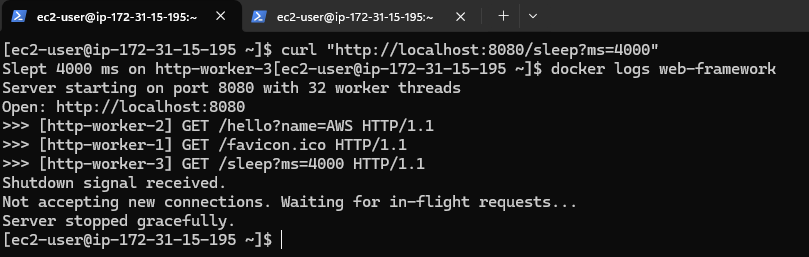

# ⚙️ Web Framework

Mini framework HTTP en Java que permite registrar endpoints mediante funciones lambda,
separando la infraestructura HTTP del comportamiento de la aplicación. Maneja peticiones
de forma concurrente y se apaga de forma ordenada.

---

## 📖 Descripción

Este proyecto evoluciona un servidor HTTP básico en un mini framework web inspirado en
frameworks como Spark Java o Express.js. El desarrollador registra rutas usando lambdas
sin necesidad de modificar el loop principal del servidor.

```java
staticfiles("/webroot");

get("/hello", (req, resp) -> {
    String name = req.getValue("name");
    return "Hello, " + name + "!";
});

start();
```

---

## 🏛️ Metáfora del sistema

El framework funciona como un **edificio de oficinas con varios recepcionistas**:

| Metáfora | Componente |
|----------|------------|
| Recepción con varios encargados | `HttpServer` — acepta conexiones TCP y las reparte a un pool de hilos |
| Directorio del lobby | `Router` — mapea cada path a su handler lambda |
| Oficinas individuales | `RouteHandler` — lambdas que implementan cada servicio |
| Archivo de documentos | `StaticFileService` — sirve HTML, CSS, JS e imágenes |
| Formulario de solicitud | `Request` — encapsula método, path y query string |
| Respuesta oficial | `Response` — encapsula status y content-type |
| Configuración del edificio | Variables de entorno — PORT, APP_ENV, GREETING_PREFIX, WORKER_THREADS, SHUTDOWN_TIMEOUT_SECONDS |
| Procedimiento de cierre | `stop()` — deja de recibir visitantes nuevos, atiende a los que ya están adentro y luego cierra la puerta |

El edificio ahora atiende **varios visitantes a la vez**, cada uno con su propio
recepcionista tomado de un equipo de tamaño fijo (el pool de hilos). Si llegan más
visitantes que recepcionistas libres, esperan su turno en la fila de entrada, pero
nunca bloquean a los que ya están siendo atendidos. Cuando se avisa el cierre, el
edificio deja de dejar entrar gente nueva, pero termina de atender a quienes ya
estaban adentro antes de apagar las luces.

---

## 🏗️ Arquitectura

```
Application.java
    │
    │  get("/hello", lambda)
    │  staticfiles("/webroot")
    │  start()
    ▼
WebFramework.java  ← API pública (fachada), lee configuración de variables de entorno
    │
    ├──► Router.java (ConcurrentHashMap, seguro para acceso concurrente)
    │        │
    │        │  resolve(path) → RouteHandler
    │        ▼
    │    RouteHandler (lambda)
    │        │
    │        ├── Request.java  ← método, path, query params
    │        └── Response.java ← status, content-type
    │
    └──► HttpServer.java
             │
             ├── Hilo principal: solo acepta conexiones (accept loop)
             ├── Pool de hilos (WORKER_THREADS): cada conexión se atiende en su propio hilo
             │      ├── Ruta dinámica encontrada → ejecuta lambda → responde
             │      ├── Archivo estático encontrado → StaticFileService → responde bytes
             │      └── Nada encontrado → 404 Not Found
             └── stop() / SIGTERM → deja de aceptar conexiones, espera hasta
                    SHUTDOWN_TIMEOUT_SECONDS a que terminen las peticiones en curso
```

---

## 📁 Estructura del proyecto

```
web-framework/
├── pom.xml
├── Dockerfile
├── .dockerignore
├── README.md
├── .gitignore
├── imgs/
│   ├── evd01-concurrency-browser.png
│   ├── evd02-graceful-shutdown-local.png
│   ├── evd03-dockerhub-repo.png
│   └── evd04-ec2-shutdown-evidence.png
└── src/
    ├── main/
    │   ├── java/
    │   │   └── co/edu/escuelaing/
    │   │       ├── webframework/
    │   │       │   ├── WebFramework.java      ← API pública
    │   │       │   ├── HttpServer.java        ← Servidor TCP/HTTP concurrente
    │   │       │   ├── Router.java            ← Mapeo path → lambda
    │   │       │   ├── RouteHandler.java      ← Interfaz funcional
    │   │       │   ├── Request.java           ← Abstracción del request
    │   │       │   ├── Response.java          ← Abstracción del response
    │   │       │   └── StaticFileService.java ← Archivos estáticos
    │   │       └── app/
    │   │           └── Application.java       ← Aplicación de ejemplo
    │   └── resources/
    │       └── webroot/
    │           ├── index.html
    │           ├── styles.css
    │           ├── app.js
    │           └── images/
    │               └── logo.png
    └── test/
        └── java/
            └── co/edu/escuelaing/webframework/
                └── HttpServerTest.java        ← Tests de concurrencia y shutdown
```

---

## 🔑 Responsabilidades de cada componente

| Componente | Responsabilidad |
|------------|----------------|
| `WebFramework` | API pública: expone `get()`, `staticfiles()`, `start()`, `stop()`. Lee la configuración de variables de entorno. |
| `HttpServer` | Acepta conexiones TCP en un hilo dedicado y las delega a un pool de workers. Implementa el apagado ordenado. |
| `Router` | Registra y resuelve rutas dinámicas mediante un mapa concurrente (`ConcurrentHashMap`) path → lambda |
| `RouteHandler` | Interfaz funcional que permite usar lambdas como handlers |
| `Request` | Encapsula método HTTP, path y query string con acceso por clave |
| `Response` | Encapsula status code y content-type de la respuesta |
| `StaticFileService` | Sirve archivos del classpath con detección de content-type |
| `Application` | Registra las rutas y configura el framework |

---

## ⚙️ Prerrequisitos

- Java 21+
- Maven 3.8+
- Docker (para construir y correr la imagen)

---

## 🚀 Cómo ejecutar localmente

**1. Clonar el repositorio:**
```bash
git clone https://github.com/juanpablo012501/web-framework.git
cd web-framework
```

**2. Compilar y correr los tests:**
```bash
mvn clean package
```
Esto compila el proyecto y ejecuta los tests de `HttpServerTest`, que verifican que las
peticiones se atienden en paralelo y que el servidor se apaga de forma ordenada.

**3. Ejecutar:**
```bash
java -jar target/web-framework.jar
```

**4. Abrir en el navegador:**
```
http://localhost:8080
```

---

## 🌍 Variables de entorno

| Variable | Propósito | Valor por defecto |
|----------|-----------|-------------------|
| `PORT` | Puerto del servidor HTTP | `8080` |
| `APP_ENV` | Entorno de ejecución | `development` |
| `GREETING_PREFIX` | Prefijo del mensaje de saludo | `Hello` |
| `WORKER_THREADS` | Hilos del pool que atienden peticiones en paralelo | `32` |
| `SHUTDOWN_TIMEOUT_SECONDS` | Tiempo máximo de espera por peticiones en curso al apagar | `8` |

> ⚠️ Cuando `APP_ENV=production` la ruta `/shutdown` no está disponible.

---

## 🔗 Endpoints disponibles

### Recursos estáticos

| URL | Descripción |
|-----|-------------|
| `GET /` | Página principal |
| `GET /index.html` | Página HTML |
| `GET /styles.css` | Estilos CSS |
| `GET /app.js` | JavaScript cliente |
| `GET /images/logo.png` | Imagen logo |

### Servicios dinámicos

| URL | Parámetros | Respuesta |
|-----|------------|-----------|
| `GET /hello?name=Juan` | `name` (opcional) | `Hello, Juan!` |
| `GET /pi` | ninguno | `3.141592653589793` |
| `GET /square?value=5` | `value` (requerido) | `{"input": 5.0, "square": 25.0}` |
| `GET /time` | ninguno | `{"serverTime": "2026-09-28 21:43:00"}` |
| `GET /sleep?ms=2000` | `ms` (opcional, máx. 5000) | Espera `ms` milisegundos y responde con el hilo que la atendió. Usada para demostrar concurrencia. |
| `GET /shutdown` | ninguno | Solo disponible en `development` |

---

## ⚡ Concurrencia

El servidor original atendía una conexión a la vez: mientras procesaba una petición,
cualquier otra tenía que esperar en cola, incluso si esa primera conexión no enviaba
nada (por ejemplo, un cliente que se queda conectado sin mandar datos bloqueaba a
todos los demás indefinidamente).

Ahora el hilo principal (`HttpServer`) solo hace `accept()` sobre el socket y delega
cada conexión a un `ExecutorService` de tamaño fijo (`WORKER_THREADS`, por defecto 32).
Cada petición se procesa en su propio hilo, de forma independiente.

**Evidencia:** se lanzaron varias peticiones a `/sleep?ms=3000` casi al mismo tiempo
desde el navegador. Si el servidor fuera secuencial, tardarían `3s × n peticiones`;
en cambio, todas responden en aproximadamente 3 segundos en total, y cada una reporta
haber sido atendida por un hilo distinto (`http-worker-1`, `http-worker-2`, ...). Ver
la demostración en el [video de la demo](https://youtu.be/yFlN1AqkF_c).

---

## 🛑 Apagado ordenado (graceful shutdown)

El servidor original terminaba el proceso de inmediato al recibir una señal de
apagado (por ejemplo, la que envía `docker stop`), sin importar si había una petición
en curso — el cliente recibía la conexión cortada abruptamente.

Ahora, al llamar `stop()` (desde `/shutdown` o al recibir SIGTERM/SIGINT vía un
shutdown hook), el servidor:

1. Deja de aceptar conexiones nuevas.
2. Espera a que las peticiones ya en curso terminen, hasta `SHUTDOWN_TIMEOUT_SECONDS`.
3. Si se cumple el tiempo máximo, fuerza el cierre de lo que quede pendiente.
4. Recién entonces termina el proceso, dejando constancia en el log
   (`Server stopped gracefully.`).

**Evidencia local (jar suelto):** se lanzó `GET /sleep?ms=4000` y, mientras estaba en
curso, se envió `SIGTERM` al proceso. La petición terminó con su respuesta completa
(`200 OK`) y el log mostró la secuencia de cierre ordenado antes de que el proceso
terminara.


**Evidencia en Docker:** se repitió la misma prueba dentro de un contenedor —
`docker stop -t 20 web-framework` mientras `/sleep?ms=4000` estaba en curso. La
petición completó con `200 OK` y el log del contenedor mostró
`Server stopped gracefully.` al final. (Con el timeout por defecto de Docker, 10s, el
apagado llegó a fallar por la latencia de red de Docker Desktop en Windows; por eso se
usa `-t 20` al detener el contenedor, y `SHUTDOWN_TIMEOUT_SECONDS=15` al correrlo, para
dejar margen suficiente.)

---

## 🐳 Docker

**1. Construir la imagen** (multi-etapa: compila con Maven + Corretto 21, y la imagen
final solo lleva el JRE y el jar):
```bash
docker build -t juanpa2001/web-framework:1.0 .
```

**2. Correr el contenedor:**
```bash
docker run -d \
  --name web-framework \
  --restart unless-stopped \
  -e SHUTDOWN_TIMEOUT_SECONDS=15 \
  -p 8080:8080 \
  juanpa2001/web-framework:1.0
```

**3. Probar:**
```
http://localhost:8080/hello?name=Container
```

**4. Publicar en Docker Hub:**
```bash
docker tag juanpa2001/web-framework:1.0 juanpa2001/web-framework:latest
docker push juanpa2001/web-framework:1.0
docker push juanpa2001/web-framework:latest
```

Docker Hub repository: https://hub.docker.com/r/juanpa2001/web-framework



---

## 🧪 Pruebas realizadas

| Prueba | URL / acción | Resultado |
|--------|-----|-----------|
| Página principal | `GET /` | ✅ 200 OK |
| Saludo con nombre | `GET /hello?name=Juan` | ✅ `Hello, Juan!` |
| Saludo sin nombre | `GET /hello` | ✅ `Hello, world!` |
| Valor de PI | `GET /pi` | ✅ `3.141592653589793` |
| Cuadrado válido | `GET /square?value=121` | ✅ `121² = 14641` |
| Hora del servidor | `GET /time` | ✅ JSON con hora |
| Archivo faltante | `GET /noexiste.html` | ✅ 404 Not Found |
| Path traversal | `GET /../etc/passwd` | ✅ 404 Not Found (la ruta con `..` se rechaza antes de tocar el archivo) |
| Concurrencia | 5+ peticiones simultáneas a `/sleep?ms=3000` | ✅ Todas responden en ~3s, no en 3s×n |
| Conexión inactiva no bloquea otras | 1 conexión abierta sin enviar datos + otra petición normal | ✅ La segunda petición responde sin esperar a la primera |
| Shutdown en desarrollo | `GET /shutdown` | ✅ Servidor se detiene tras responder |
| Shutdown en producción | `GET /shutdown` | ✅ 404 Not Found |
| Graceful shutdown (SIGTERM) | SIGTERM con petición en curso | ✅ La petición en curso completa antes de que el proceso termine |
| Graceful shutdown en Docker | `docker stop -t 20` con petición en curso | ✅ Petición completa; log muestra `Server stopped gracefully.` |
| Tests automatizados | `mvn clean package` (`HttpServerTest`) | ✅ 3/3 tests pasan |

---

## ☁️ Deploy en AWS EC2

**Plataforma:** Amazon Web Services — EC2
**Sistema operativo:** Amazon Linux 2023
**Tipo de instancia:** t3.micro
**Región:** us-east-1 (N. Virginia)
**URL pública:** `http://ec2-44-198-157-4.compute-1.amazonaws.com:8080`

> Esta instancia se comparte con el Repositorio 1 (`virtualization-lab`). El Security
> Group permite los puertos 22 (SSH) y 8080 (app) solo desde la IP del autor.

### Pasos para reproducir el deploy

**1. Conectarse por SSH:**
```bash
ssh -i "cirtualization-spring.pem" ec2-user@ec2-44-198-157-4.compute-1.amazonaws.com
```

**2. Asegurar que Docker está corriendo:**
```bash
sudo service docker start
```

**3. Descargar la imagen publicada en Docker Hub:**
```bash
docker pull juanpa2001/web-framework:1.0
```

**4. Ejecutar en producción**, con margen suficiente para el apagado ordenado:
```bash
docker run -d \
  --name web-framework \
  --restart unless-stopped \
  -e SHUTDOWN_TIMEOUT_SECONDS=15 \
  -p 8080:8080 \
  juanpa2001/web-framework:1.0
```

**5. Verificar:**
```bash
docker ps
docker logs web-framework
```

**6. Probar desde afuera:**
```
http://ec2-44-198-157-4.compute-1.amazonaws.com:8080/hello?name=AWS
```

### Evidencia del graceful shutdown en EC2

Se repitió la prueba de apagado ordenado ya desplegado en la nube: una petición a
`/sleep?ms=4000` en curso, y `docker stop -t 20 web-framework` ejecutado desde una
segunda sesión SSH mientras la primera seguía esperando la respuesta.

```
$ curl "http://localhost:8080/sleep?ms=4000"
Slept 4000 ms on http-worker-3

$ docker logs web-framework
Server starting on port 8080 with 32 worker threads
Open: http://localhost:8080
>>> [http-worker-3] GET /sleep?ms=4000 HTTP/1.1
Shutdown signal received.
Not accepting new connections. Waiting for in-flight requests...
Server stopped gracefully.
```



---

## 🎥 Demo video

Short video showing local Docker deployment (concurrency and graceful shutdown) and
the application running on AWS EC2:

[Watch the demo video](https://youtu.be/590FSCKCeoI)

---

## 📌 Progreso y evidencia del commit

Commit principal de esta extensión: `Implement concurrent request handling and graceful shutdown`
([ver commit](https://github.com/juanpablo012501/web-framework/commit/63e3d1f))

Cambios incluidos en este commit:
- Servidor concurrente con pool de hilos configurable (`WORKER_THREADS`)
- Apagado ordenado con espera de peticiones en curso (`SHUTDOWN_TIMEOUT_SECONDS`) y
  manejo de señales del sistema operativo (shutdown hook)
- Ruta `/sleep` para demostrar concurrencia
- `Dockerfile` multi-etapa y `.dockerignore`
- Tests automatizados de concurrencia y shutdown (`HttpServerTest`)
- `pom.xml` alineado a Java 21

---

## 🔧 ¿Por qué esta arquitectura es mantenible?

| Principio | Aplicación en este laboratorio |
|-----------|-------------------------------|
| Separación de responsabilidades | La infraestructura HTTP está separada del comportamiento de la aplicación |
| Bajo acoplamiento | Agregar una ruta no requiere modificar el loop del servidor |
| Alta cohesión | Cada clase tiene una única responsabilidad clara |
| Abstracción | El desarrollador usa `get()` y `staticfiles()` sin manejar sockets ni hilos |
| Configuración externalizada | Puerto, entorno, hilos y timeouts vienen de variables de entorno |
| Extensibilidad | Nuevos servicios se agregan registrando lambdas |
| Testabilidad | `HttpServer` se puede instanciar y probar de forma aislada (ya no es estático) |
| Concurrencia segura | `Router` usa `ConcurrentHashMap`, accedido desde múltiples hilos worker |

---

## ⚠️ Limitaciones conocidas

- Solo maneja el método GET.
- No soporta HTTPS.
- El pool de hilos es de tamaño fijo (`WORKER_THREADS`): con más peticiones simultáneas
  que hilos disponibles, las peticiones extra esperan en la cola de conexiones aceptadas
  en vez de ser rechazadas, pero no hay backpressure explícito ni cola acotada.
- No es un servidor de producción (sin logging estructurado, métricas, ni HTTPS).

---

## 👤 Autor

**Juan Pablo Velez Munoz**
Escuela Colombiana de Ingeniería Julio Garavito
